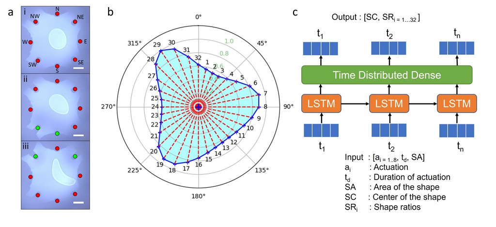
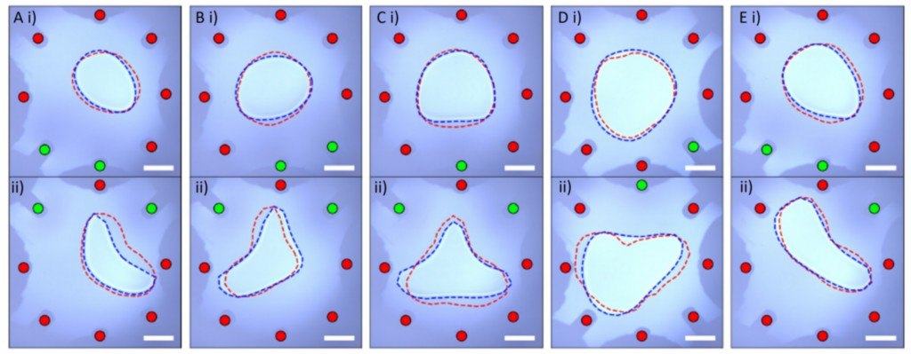

# Droplet-Shape-Prediction-LSTM
LSTM model for shape prediction of a droplet at the air-magnetic liquid interface due to sequential actuations of electromagnets.

#### Method

Figure 1 a) Experimental data of a hexadecane droplet at the air-ferrofluid interface for the initial state and two sequential
actuations of the solenoids b) Shape representation with 32 segments along the contour of the shape c) LSTM-based
model for shape prediction. The scale bars are 2 mm. [1]

#### Shape prediction results

Figure 2. Validation results for shape prediction of a hexadecane droplet at the air-ferrofluid interface for five sequences.
The blue and red dashed lines show the actual and predicted contours, respectively. Actuated solenoids are marked with
green indicators and deactivated solenoids are marked with red indicators. The scale bars are 2 mm. [1]

Publication:

[1] P. A. D. Harischandra and Q. Zhou, "Learning to Shape Liquid Droplets on an Air-Ferrofluid Interface with Sequences of Actuation," 2023 International Conference on Manipulation, Automation and Robotics at Small Scales (MARSS), Abu Dhabi, United Arab Emirates, 2023, pp. 1-6, doi: 10.1109/MARSS58567.2023.10294154.

Accepted version: https://urn.fi/URN:NBN:fi:aalto-202312117279